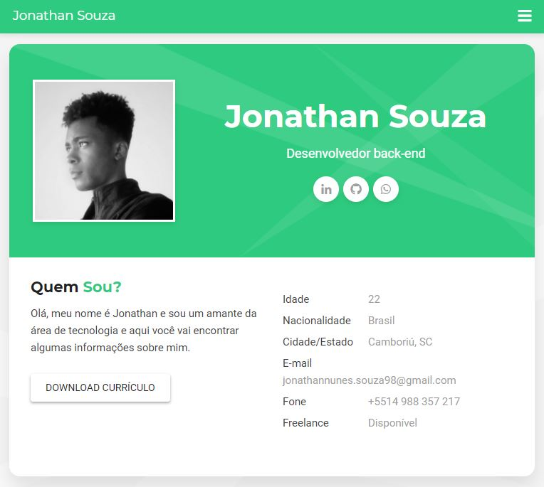
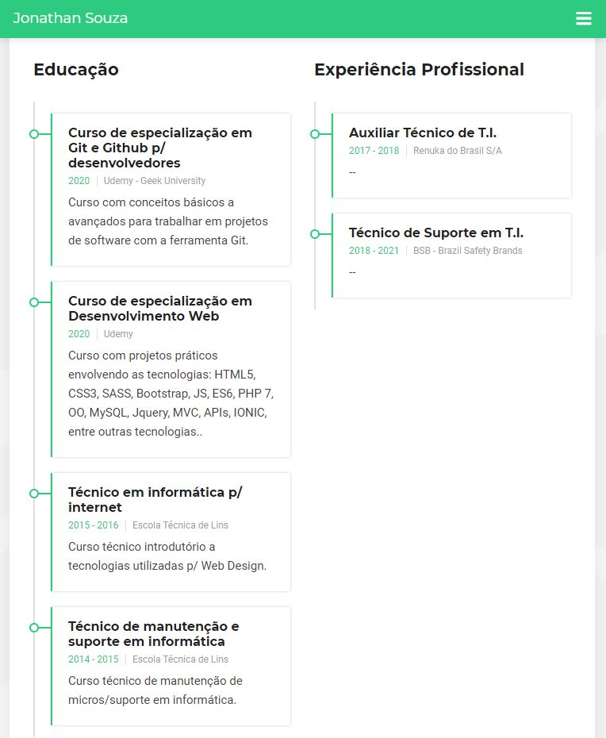

# Cúrriculo online 
> Um currículo online feito no [curso de Git e Github da Geek
University].

Este projeto nada mais é que uma página html estática, que foi utilizada p/ testar conceitos práticos do uso das ferramentas Git e Github.




## Instalação 

Basta clonar o repositório da forma desejada.

```
$ git clone https://github.com/jonathannunesdsouza/jonathannunesdsouza.github.io.git
```

## Histórico de atualização 

* 0.0.1;
    * Lançamento inicial.

## Meta 

Jonathan Douglas Nunes de Souza - [@jonathansouza] - <jonathannunes.souza98@gmail.com>

[@jonathansouza]:https://www.linkedin.com/in/perfil-in/

Distribuido sob licença. Veja **`LICENÇA`** para mais informações.

[https://github.com/jonathannunesdsouza/jonathannunesdsouza.github.io]

[curso de Git e Github da Geek University]:https://www.udemy.com/course/curso-de-git-e-github-essencial/
